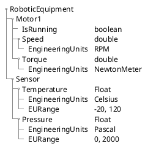

# Enhancing Industrial Automation with OPC UA Modeling and Object-Oriented Process Modeling

The traditional PLC tag naming convention has been the standard for industrial automation for decades. However, it has its limitations, such as the lack of clarity due to compressed names, limited length, and the need to include variable types in the names which hinder scalability and interoperability.

This article will explain how OPC UA modeling and Object-Oriented Process Modeling provide a more intuitive, self-descriptive, expressive, and interoperable alternative that will help you scale and facilitate data organization and logical reasoning accross the organization.

## The Shortcomings of Traditional PLC Tag Naming

Traditional PLC tag naming conventions rely heavily on user-defined names for variables or tags, which represent inputs, outputs, and internal values of a PLC program. 

PLCs traditionally work with registers and linear tables, and tags identify these registers. 

Let's consider a complex Robotic Equipment with a motor exposing speed, torque, and position, as well as a sensor exposing temperature and pressure.

In the traditional PLC tag naming convention, these might be represented as follows:

| Tag Name | Description |
|----------|-------------|
|M1_SPD_X | Motor 1 Speed, Boolean| 
|M1_TQ_DW | Motor 1 Torque, Double Word|
|M1_POS_F | Motor 1 Position, Float|
|S1_TMP_R | Sensor 1 Temperature, Real|
|S1_PRS_I | Sensor 1 Pressure, Integer|

Due to the limited length of tags imposed by the PLC, they often need to be compressed, leading to a lack of clarity.

The tag `"M1_SPD_X"` can be interpreted this way:
-  `"M1"` represents `Motor 1`,
-  `"SPD"` represents speed,
-   and `"X"` represents the data type (in this case, a boolean). 

Standard practice and guidelines are well documented in the `IEC 61131-3 standard`, which provides a set of rules for naming variables and tags. Most PLC manufacturers have their own guidelines and best practices for naming conventions that are based on this `IEC 61131-3 standard`.

While this method offers simplicity, it falls short in several key areas:

* __Lack of Scalability__: As systems expand, maintaining a coherent and intuitive naming convention becomes cumbersome, leading to increased potential for errors.
  
* __Lack of nteroperability__: Lack of standardization can hinder the integration of devices and systems from different manufacturers, complicating system upgrades and expansions.

* __Lack of Clarity__ : With complex systems, tag names can become cryptic and hard to understand, especially for non PLC programmer or for personnel not involved in the initial design process.

This model is familiar to the PLCs engineers. This is the way, the PLC world has been working for decades, and it has been working well. 

However when it comes to make real-time process data available to non PLC specialists,  this naming convention can become confusing and difficult to manage, especially in complex systems with thousands of tags.

With the advent of Industry 4.0, the need for a more expressive, interoperable, and scalable naming convention has become apparent. 

## Bridging the OT and IT world

In Industry 4.0, the convergence of Operational Technology (OT) and Information Technology (IT) is a key to building a smart factory, where data is collected, analyzed, and used to optimize processes and improve efficiency.

This requires that the PLC's layers communicates to the IT layers in a seamless and interoperable way.

This also requires that IT domain experts can understand and interpret the data coming from the OT domain.

This is where __OPC UA__ and __Object-Oriented Process Modeling__ come into play.

## OPC UA to the rescue

__OPC UA__ (Open Platform Communications Unified Architecture) is a machine-to-machine communication protocol for industrial automation developed by the OPC Foundation. 
It is designed to provide a more secure, reliable, and interoperable alternative to the traditional OPC (OLE for Process Control) protocol. 
It has a rich information model and a flexible address space that can be used to represent complex systems and processes.

Now suppose we want to expose the same Robotic Equipment with a motor and a sensor to the IT world using OPC UA.

In OPC UA, the same variables would be represented as follows:

<!--

-->

Note the hierarchy and the rich set of attributes that can be used to represent the variables and the logical structure of the system.

## Recommendations for Implementing OPC UA and Object-Oriented Process Modeling:

When wrapping a PLC with an OPC UA server to enhance interoperability, the following principles should apply:

* __Rethink the Exposed Variables:__ Take this opportunity to create meaningful or long descriptive names that provide clarity and improve understanding.
* __Avoid Data Type Decoration__: In traditional PLC tag naming, variable types are included in the names. In OPC UA, use the DataType attribute for this purpose.
* __Use Clear Naming for Booleans__: For boolean variables, use names like `"IsMotorRunning"` or `"HasSensorTriggered"` to improve readability.
* __Use Verbs for Actions and Methods__: For actions and methods, use names like `"StartMotor"` or `"SetActiveRecipe"` to indicate the intended function.
* __Use Enumeration for States__: For states, use an enumeration to represent the state of a machine or process, such as `"Running"`, `"Stopped"`, or `"Faulted"`.
* __Hide PLC Internals__: Your PLC exposes many data points, but not all are necessary. Select the few meaningful and important process variables that are useful and hide the implementation details.
* __Collaborate with the Appropriate Team__: Involve the right people in the process, including automation engineers, software developers, and other stakeholders.
* __Leverage Companion Specifications__: Bind your ObjectType with companion specifications as much as possible and leverage the models that have already been built by the community and working groups.
* __Grow Your Model on Demand__: Keep your model extendable by adding new modules as needed, ensuring backward compatibility.
* __Enrich your model__ with meta data (EngineeringUnits, Description, DisplayName, etc.) to ensure intuitive and error-prone usage, hence avoiding the need for documentation and misinterpretation.
* __Use AnalogDataItem for Analog Values__: Use the AnalogDataItem type for analog values, which provides a rich set of attributes for engineering units, range, and precision.
* __Use Multi-StateDiscrete for States__: Use the Multi-StateDiscrete type for states, which provides a rich set of attributes for states and transitions.
* __Implements Alarm and Condition__: Use the Alarm and Condition model to represent alarms and conditions in your system, providing a rich set of attributes for severity, priority, and time stamps.

## Real-world Example:

In OPC UA and Object-Oriented Process Modeling, following the recommendations above, these would be represented as follows:

## Conclusion:

Whereas  IEC 61131-3  and  PLCopen  provide a standard for programming languages and control logic,  OPC UA  provides a standard for data modeling and communication and naming conventions, when exposing industrial equipment data to the enterprise level it is important to use the power of OPC UA to create a reusable, interoperable, intuitive, and self-descriptive, human readable, allowing better and faster integration with other systems and devices up and down the automation pyramid.

OPC UA provide a reusable, interoperable, intuitive, and self-descriptive model that improves data organization and logical reasoning, making it an ideal choice for complex industrial automation systems.

By leveraging OPC UA and Object-Oriented Process Modeling, you can create a scalable and maintainable model that is easy to understand and extend, ensuring that your system is future-proof and ready for integration with other systems and devices.

## About the Author:

Etienne Rossignon is a software architect and OPC UA expert and CEO at Sterfive. He has been working in the industrial software world for more than 20 years, and has been involved in the development of several OPC UA products and projects. He is also a member of the OPC Foundation and is the author of NodeOPCUA the renowned OPC UA development stack for Node.js, and @opcua/for-node-red.

## References:

 - https://plcopen.org/guidelines/guidelines
 - [Naming Convention and Data Structure for Industrial PLCs](https://www.optimizedtechnicalsolutions.com/ReferenceDocuments/Naming%20Conventions%20and%20Data%20Structures%20for%20Industrial%20PLCs.pdf)
 - [OPCUA Modeler by Sterfive](https://www.sterfive.com/product/modeler)
  
 - [Information Modeling in OPC UA](https://reference.opcfoundation.org/DI/v102/docs/4.2.1)
 - [OPC UA Modeling best practises](https://opcfoundation.org/developer-tools/documents/view/312)
- 