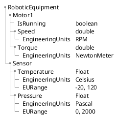
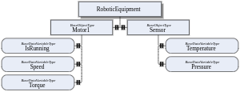

# Enhancing Industrial Automation with OPC UA Modeling and Object-Oriented Process Modeling

Introduction:

The traditional PLC tag naming convention has been the standard for industrial automation for decades. However, it has its limitations, such as the lack of clarity due to compressed names, limited length, and the need to include variable types in the names. This article will explain how OPC UA modeling and Object-Oriented Process Modeling provide a more intuitive, self-descriptive, expressive, and interoperable alternative that will help you scale and facilitate data organization and logical reasoning.

## The Shortcomings of Traditional PLC Tag Naming

Traditional PLC tag naming conventions rely heavily on user-defined names for variables or tags, which represent inputs, outputs, and internal values of a PLC program. While this method offers simplicity, it falls short in several key areas:

Scalability: As systems expand, maintaining a coherent and intuitive naming convention becomes cumbersome, leading to increased potential for errors.
Interoperability: Lack of standardization can hinder the integration of devices and systems from different manufacturers, complicating system upgrades and expansions.
Clarity: With complex systems, tag names can become cryptic and hard to understand, especially for personnel not involved in the initial design process.

PLCs traditionally work with registers and linear tables, and tags identify these registers. Due to the limited length of tags, they often need to be compressed, leading to a lack of clarity. For example, a tag for a motor speed might look like this: "M1_SPD_X", where "M1" represents Motor 1, "SPD" represents speed, and "X" represents the data type (in this case, a boolean). This naming convention can become confusing and difficult to manage, especially in complex systems with thousands of tags.

## Recommendations for Implementing OPC UA and Object-Oriented Process Modeling:

When wrapping a PLC with an OPC UA server to enhance interoperability, the following principles should apply:

* Rethink the Exposed Variables: Take this opportunity to create meaningful or long descriptive names that provide clarity and improve understanding.
* Avoid Data Type Decoration: In traditional PLC tag naming, variable types are included in the names. In OPC UA, use the DataType attribute for this purpose.
µ Use Clear Naming for Booleans: For boolean variables, use names like "IsMotorRunning" or "HasSensorTriggered" to improve readability.
* Use Verbs for Actions and Methods: For actions and methods, use names like "StartMotor" or "SetActiveRecipe" to indicate the intended function.
* Hide PLC Internals: Your PLC exposes many data points, but not all are necessary. Select the few meaningful and important process variables that are useful and hide the implementation details.
* Collaborate with the Appropriate Team: Involve the right people in the process, including automation engineers, software developers, and other stakeholders.
* Leverage Companion Specifications: Bind your ObjectType with companion specifications as much as possible and leverage the models that have already been built by the community and working groups.
* Grow Your Model on Demand: Keep your model extendable by adding new modules as needed, ensuring backward compatibility.
* Enrich your model with meta data (EngineeringUnits, Description, DisplayName, etc.) to ensure intuitive and error-prone usage, hence avoiding the need for documentation and misinterpretation.

## Real-world Example:

Let's consider a complex Robotic Equipment with a motor exposing speed, torque, and position, as well as a sensor exposing temperature and pressure.

In the traditional PLC tag naming convention, these might be represented as follows:

| Tag Name | Description |
|----------|-------------|
|M1_SPD_X | Motor 1 Speed, Boolean| 
|M1_TQ_DW | Motor 1 Torque, Double Word|
|M1_POS_F | Motor 1 Position, Float|
|S1_TMP_R | Sensor 1 Temperature, Real|
|S1_PRS_I | Sensor 1 Pressure, Integer|

In OPC UA and Object-Oriented Process Modeling, following the recommendations above, these would be represented as follows:

# Conclusion:

OPC UA provide a reusable, interoperable, intuitive, and self-descriptive model that improves data organization and logical reasoning, making it an ideal choice for complex industrial automation systems.

By leveraging OPC UA and Object-Oriented Process Modeling, you can create a scalable and maintainable model that is easy to understand and extend, ensuring that your system is future-proof and ready for integration with other systems and devices.